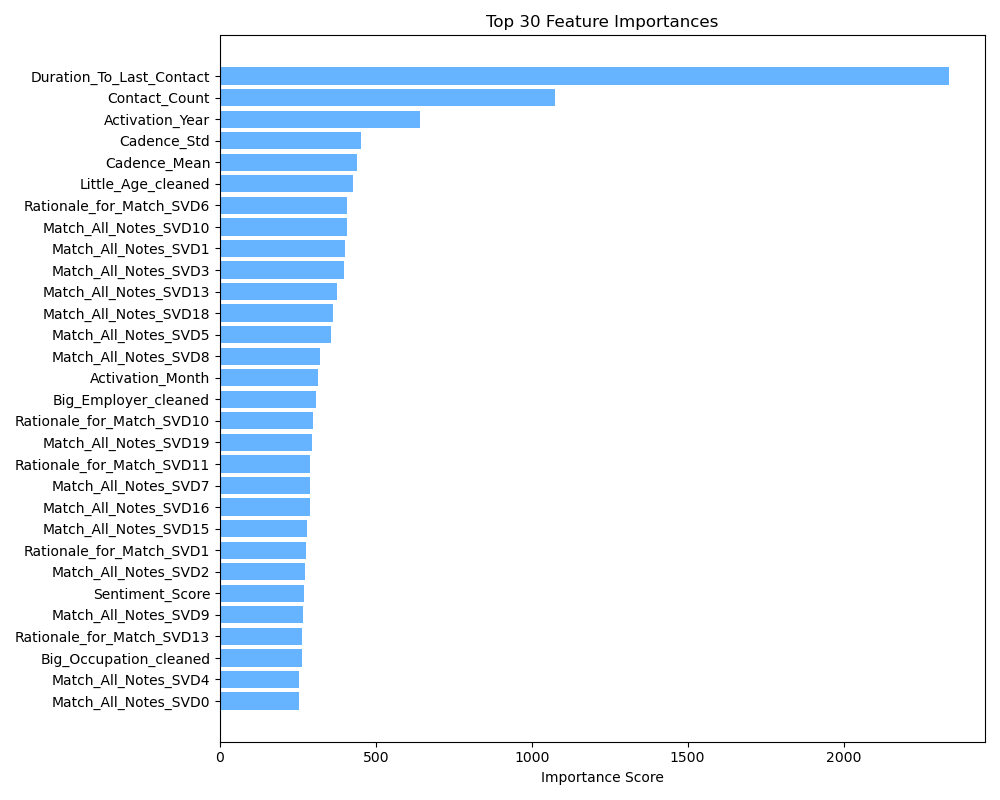
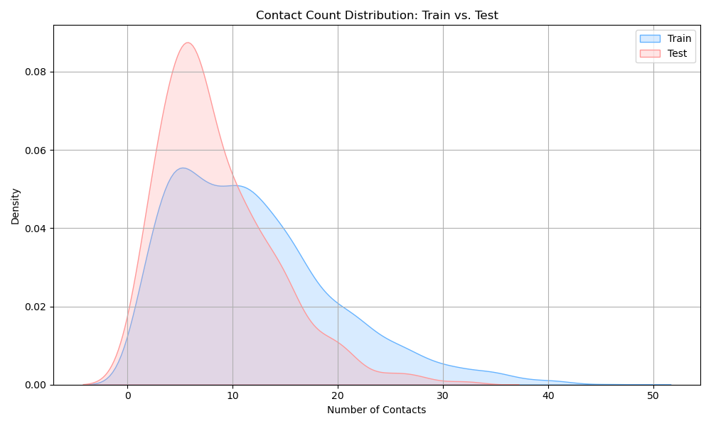
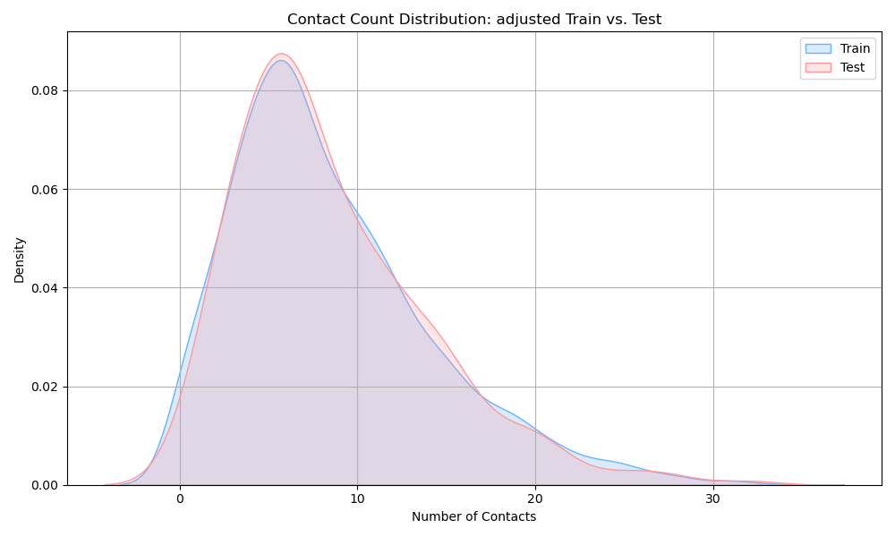
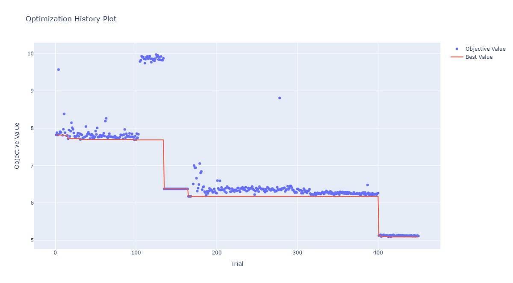

# Competition ML Pipeline

This repository contains a complete machine learning pipeline developed
for a competition setting with truncated test data.
Competition name: MUDAC2025

## Project Overview

The project focuses on:
- Training–test distribution alignment
- Feature engineering on temporal and textual data
- Model exploration and hyperparameter tuning
- Post-model validation and deliverability checks

Due to competition rules, raw datasets are not included.

## Pipeline Structure

- `check.py`  
  Premodel data distribution check

- `adjust.py`  
  Aligns training data distribution with the truncated test set.

- `functions.py`  
  Core feature engineering utilities (text processing, encoding, metrics).

- `main.py`  
  Constructs final modeling datasets from raw inputs.

- `models.py`  
  Model comparison and hyperparameter optimization.

- `final_validation.py`  
  Train–test distribution comparison for deliverability validation.

## Data Availability

Raw training and test data are excluded in compliance with competition rules.
All file paths are left as placeholders for reference.

## Results Overview

### Feature Importance Analysis

### Train–Test Distribution Alignment

### Hyperparameter Optimization & final RMSE
